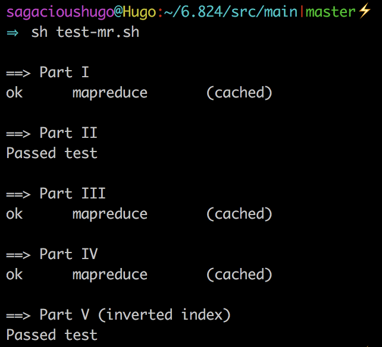
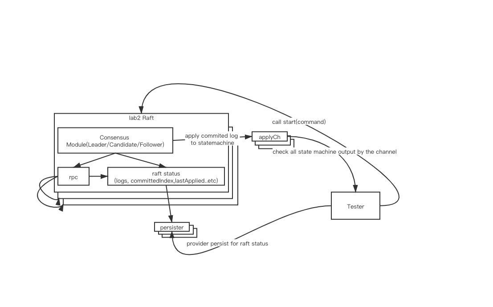
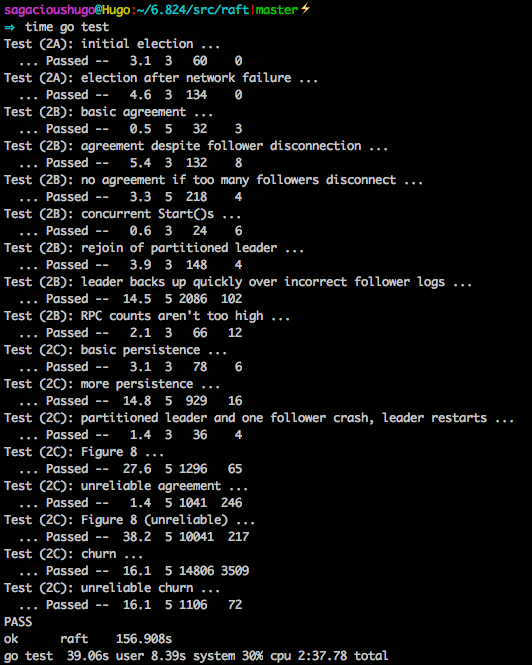
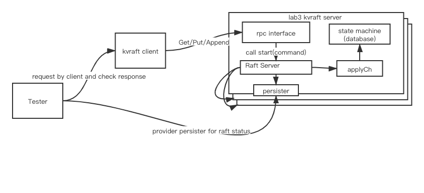
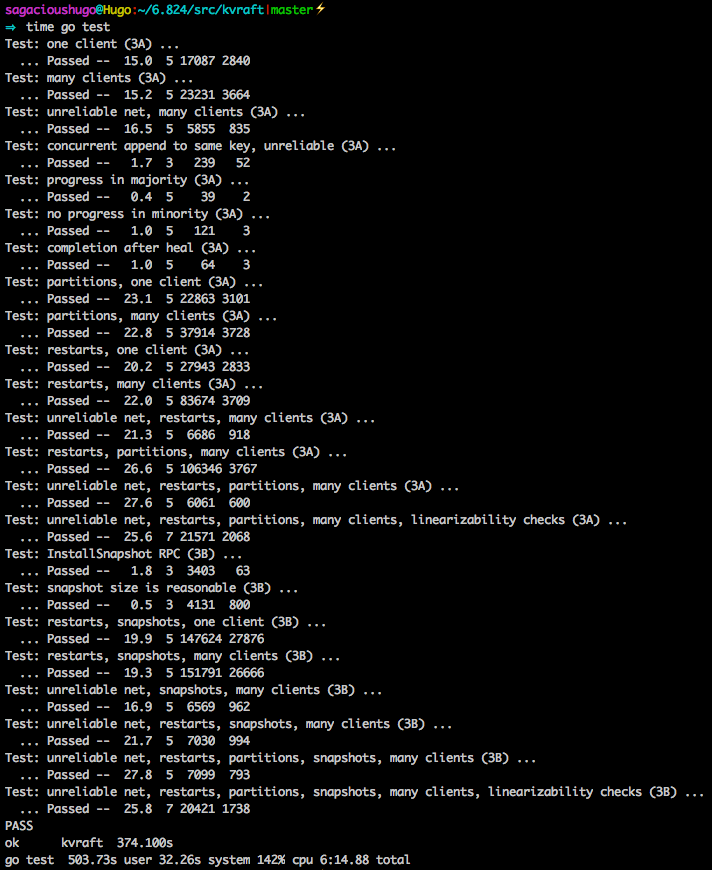
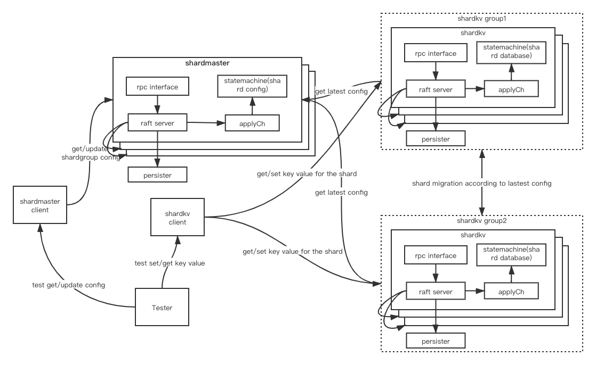
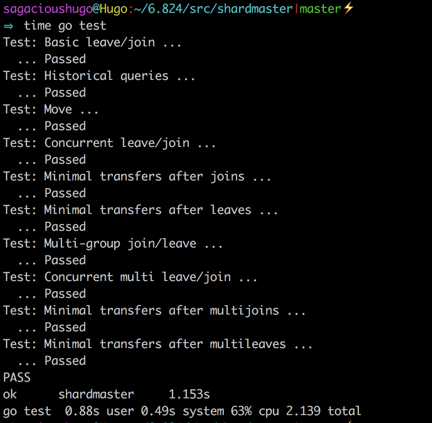
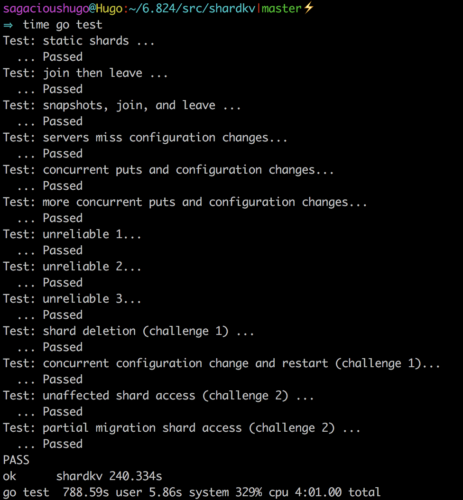

## MIT 6.824分布式系统实验课程代码（2018）

MIT 6.824分布式系统课程,是一门著名的讲解分布式系统设计原理的课程。

官方网站[http://nil.csail.mit.edu/6.824/2018/index.html](http://nil.csail.mit.edu/6.824/2018/index.html)


包括4个Lab：
- [Lab 1: MapReduce](http://nil.csail.mit.edu/6.824/2018/labs/lab-1.html)
- [Lab 2: Raft](http://nil.csail.mit.edu/6.824/2018/labs/lab-raft.html)
- [Lab 3: Fault-tolerant Key/Value Service](http://nil.csail.mit.edu/6.824/2018/labs/lab-kvraft.html)
- [Lab 4: Sharded Key/Value Service](http://nil.csail.mit.edu/6.824/2018/labs/lab-shard.html)


说明：
Lab1是MapReduce，需要在基础代码上补全MapReduce框架，并实现Map函数和Reduce函数；
Lab2是Raft算法的实现，需要根据Raft论文完成Raft算法
Lab3是分布式kv存储服务的实现，基于Lab2中的Raft实现分布式kv存储服务的客户端代码和服务端代码
Lab4是分片的分布式kv存储服务的实现，基于Lab3中的分布式kv存储服务进行扩展，分别实现shardmaster（管理shard-group映射关系）和shardkv（需要实现shard迁移）

Lab1比较独立，Lab2 3 4是逐步增加难度并且后一个实验依赖于前一个实验。

实验中用Golang协程模拟分布式中的节点，节点间只通过rpc通信（rpc模拟了网络不稳定情况）。

基础代码中包含了Lab的框架和比较严格的测试代码，但是由于lab2 3 4实验比较复杂时序不确定，某些极端bug还是需要反复测试才能复现。


各部分理解和说明：
## Lab 1: MapReduce
Part I 实现MapReduce输入输出框架（doMap、doReduce两个函数）。
Part II-V 根据条件分别实现一组mapF和reduceF函数。

结果：



## Lab 2: Raft
[extended Raft paper](http://nil.csail.mit.edu/6.824/2018/papers/raft-extended.pdf)

[分布式一致性算法：Raft 算法（Raft 论文翻译）](https://www.jianshu.com/p/2a2ba021f721)

### 1. 全局需要注意的
- 收到rpc心跳请求包含term高于自己，立刻身份转变为follower，并把自己term更新为请求中的term
- 所有关键点的rpc响应（投票，commit新log，收到同步的新log，装载镜像），需要先持久化再响应
- Data Race问题：修改raft中的状态，必须加锁
- Data Race问题：日志slice只能append，若删除部分日志必须创建新slice，再把旧的需要保留的添加进来。

### 2. Leader选举关键点
涉及三个参数：当前节点的term,当前节点最后一条日志的信息lastLogIndex和lastLogTerm

给其他节点投票的必要条件：
- myTerm <= term （别人的term大于等于我的）
- myLastLogTerm < lastLogTerm || myLastLogTerm == lastLogTerm && myLastLogIndex <= lastLogIndex（别人的日志比我的新）
- 在当前term中没给其他节点投票（一个term中只能投票一次）

只有两种节点可以成为Leader:（Raft论文 5.4.1 Election restriction）
- 在最大term中接收过log的节点
- 在相同term中接收更多log节点

candidate竞选失败的4种情况：
- 某个节点失联，剩余节点竞选导致投票数恰好平均，竞选超时，开启下一轮竞选
- 大部分节点失联，无法达到超过一半的投票数，竞选超时，开启下一轮竞选
- 收到投票响应，对方term大于自己，更新自己为对方term。若自己的日志比对方新，开启下一轮竞选；否则转变为follower退出竞选
- 当前身份已经不是candidate，退出竞选（收到rpc心跳请求大于等于自己的term，发现已存在的leader，转换为follower）


### 3. 如何commit log（关键点）

### 3.1 Raft分布式事务的两个阶段

committing阶段：leader向其他节点同步自己的日志实际上就是发起一个提交事务（隐含在逻辑上发起了committing）

committed阶段：大多数节点上已经同步成功了某个index的log，并且这个log的term是leader的term，那么此时该log已经committed（无论leader和其他节点有没有来得及更新commitIndex）


### 3.2 为什么大多数同步成功且log的term等于leader的term就是完成了committed阶段？
事务提交成功的本质：提交成功的那条log已经永久的保留在集群中（这条log的index和内容不会改变）。
一旦上面2个条件符合，即使后续leader挂了，新选出的leader也必然是已经同步了这条log的节点（虽然新选出的leader不能立刻committed这条日志）。

```
假设最开始s1是leader，此时s1挂了，那么竞选成功的只可能是s2和s3（给别人投票的必要条件之一：别人的日志比我新）
s1 commitIndex = 1 [{term:1,index:1,command:"xxx"},{term:1,index:2,command:"yyy"}]

s2 commitIndex = 1 [{term:1,index:1,command:"xxx"},{term:1,index:2,command:"yyy"}]

s3 commitIndex = 1 [{term:1,index:1,command:"xxx"},{term:1,index:2,command:"yyy"}]

s4 commitIndex = 1 [{term:1,index:1,command:"xxx"}]

s5 commitIndex = 1 [{term:1,index:1,command:"xxx"}]
          
```


### 3.2 为什么leader不能committed不属于自己term的log？
如果之前的leader（这条log的term对应的）如果已经把这条日志复制给了大多数，那么这条日志是committed；
而如果之前的leader没有复制给大多数，那么这条日志不是committed的。

当前的leader不能确认之前leader的状态，所以不能确定这条log是不是committed（即使现在已经复制给了大多数节点，也可能被覆盖）


```
假设最开始s1是leader，只有s1和s2上有index=2的log，此时s1挂了
s1 term = 1 commitIndex = 1 [{term:1,index:1,command:"xxx"},{term:1,index:2,command:"yyy"}]

s2 term = 1 commitIndex = 1 [{term:1,index:1,command:"xxx"},{term:1,index:2,command:"yyy"}]

s3 term = 1 commitIndex = 1 [{term:1,index:1,command:"xxx"}]

s4 term = 1 commitIndex = 1 [{term:1,index:1,command:"xxx"}]

s5 term = 1 commitIndex = 1 [{term:1,index:1,command:"xxx"}]

因为s3 s4 s5投票，leader的成为了term=3的leader，并接收一个新log

s1 term = 1 commitIndex = 1 [{term:1,index:1,command:"xxx"},{term:1,index:2,command:"yyy"}]

s2 term = 1 commitIndex = 1 [{term:1,index:1,command:"xxx"},{term:1,index:2,command:"yyy"}]

s3 term = 2 commitIndex = 1 [{term:1,index:1,command:"xxx"}]

s4 term = 2 commitIndex = 1 [{term:1,index:1,command:"xxx"}]

s5 term = 2 commitIndex = 1 [{term:1,index:1,command:"xxx"},{term:3,index:2,command:"xxx"}]


此时s3挂了，s1重新成为leader，s1-4都可以投票，然后s1继续把自己日志复制给s3-4

s1 term = 3 commitIndex = 1 [{term:1,index:1,command:"xxx"},{term:1,index:2,command:"yyy"}]

s2 term = 3 commitIndex = 1 [{term:1,index:1,command:"xxx"},{term:1,index:2,command:"yyy"}]

s3 term = 3 commitIndex = 1 [{term:1,index:1,command:"xxx"},{term:1,index:2,command:"yyy"}]

s4 term = 3 commitIndex = 1 [{term:1,index:1,command:"xxx"},{term:1,index:2,command:"yyy"}]

s5 term = 2 commitIndex = 1 [{term:1,index:1,command:"xxx"},{term:3,index:2,command:"zzz"}]

假如此时s1认为index=2的log已经committed更新自己和s2-4的commitIndex
s1 term = 3 commitIndex = 2 [{term:1,index:1,command:"xxx"},{term:1,index:2,command:"yyy"}]

s2 term = 3 commitIndex = 2 [{term:1,index:1,command:"xxx"},{term:1,index:2,command:"yyy"}]

s3 term = 3 commitIndex = 2 [{term:1,index:1,command:"xxx"},{term:1,index:2,command:"yyy"}]

s4 term = 3 commitIndex = 2 [{term:1,index:1,command:"xxx"},{term:1,index:2,command:"yyy"}]

s5 term = 2 commitIndex = 1 [{term:1,index:1,command:"xxx"},{term:3,index:2,command:"zzz"}]


然后s1挂了，s5此时竞选成功，由于日志比别人新
s1 term = 3 commitIndex = 2 [{term:1,index:1,command:"xxx"},{term:1,index:2,command:"yyy"}]

s2 term = 4 commitIndex = 2 [{term:1,index:1,command:"xxx"},{term:4,index:2,command:"zzz"}]

s3 term = 4 commitIndex = 2 [{term:1,index:1,command:"xxx"},{term:4,index:2,command:"zzz"}]

s4 term = 4 commitIndex = 2 [{term:1,index:1,command:"xxx"},{term:4,index:2,command:"zzz"}]

s5 term = 4 commitIndex = 1 [{term:1,index:1,command:"xxx"},{term:4,index:2,command:"zzz"}]

此时就出现了逻辑矛盾，已经committed的log被新leader给覆盖了，所以leader不能committed不是自己term的log      
```


### 3.3 leader如何提交不属于自己的term的log
当前leader在自己的term成功committed了log，那么这条log之前的所有log都是committed


### 3. 如何加载/保存snapshot（3B）


什么是snapshot
snapshot即快照，指某一时刻的状态。例如一个map某时刻它的k-v键值对就是一个快照，{a:1, b:2}

log和snapshot什么关系？
这里的log是指某些操作或者命令，例如：现在的map快照 = 过去的map快照 + 中间发生的操作

{a:10, c: 1}  =  {a:1, b:2} + \[动作1删除k:b + 动作2添加kv:(c:1) + 动作3修改kv(a:10)\]

Raft中的状态机就相当于一个map，就是一系列log中包含的命令的运算结果，而snapshot就是某一个时刻的运算结果

new snapshot = command in logs(all)

new snapshot = old snapshot + command in logs(from old to new)


保存最新的snapshot状态，可以用过去的snapshot加上中间的log，这样可以节省存储空间。


所以当Raft状态机成功执行了指令后，可以保存一次当前的快照，这样快照之前的logs就可以都删除


### 4. 如何处理网络不可靠情况
rpc请求死循环，直到获得请求结果或身份发生转变退出循环


### 5. 代码逻辑架构图


### 6. 结果：


## Lab 3: Fault-tolerant Key/Value Service

基于Raft实现分布式kv，实现Raft论文中的状态机部分和snapshot的保存和加载

代码逻辑架构图：


结果：


## Lab 4: Sharded Key/Value Service
基于分布式kv，实现分片的分布式kv

代码逻辑架构图：


shardmaster结果：


shardkv结果：


